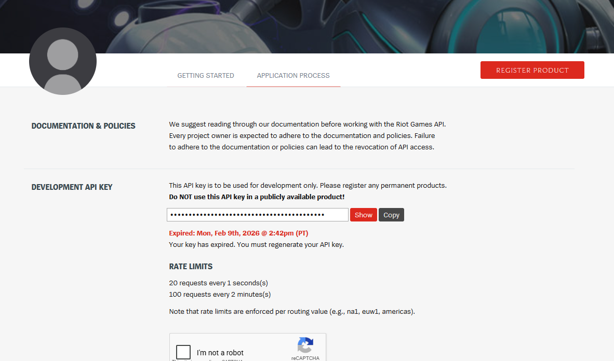
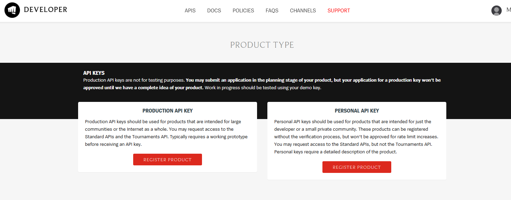
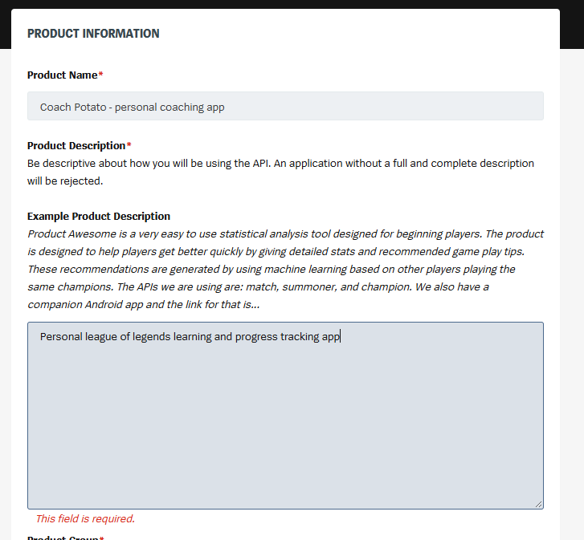
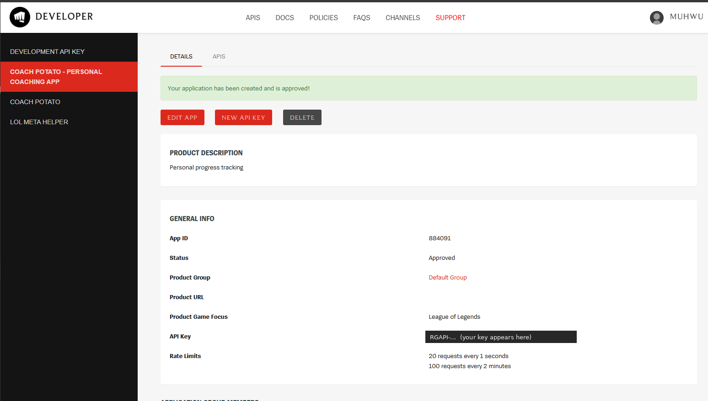

# Getting a Riot API key

Coach Potato reads your match history straight from Riot's API, so it needs an
API key — your own, free, from Riot's developer portal. The app ships without
one by design. This takes about five minutes.

There are two kinds of key:

| | Personal API key (recommended) | Development key |
|---|---|---|
| Lasts | Until you revoke it | **Expires every 24 h** |
| Setup | Register a small "product" (below) | Instant, on the portal front page |
| Rate limits | 20 req/s, 100 req/2 min | Same |

A development key is fine for trying the app out, but you'd have to paste a new
one every day. Register a personal key once and forget about it.

## 1. Sign in and click "Register product"

Go to <https://developer.riotgames.com> and sign in with your Riot account (the
same one you play League with is fine). On your dashboard, click
**Register product** in the top right.

## 2. Choose "Personal API key"

Riot offers two product types. Pick **Personal API key** → **Register
product**. (Production keys are for public websites and apps used by many
people; that's not what this is.)

## 3. Describe the product

Fill in the form. Nothing here needs to be elaborate — it's a tool for you:

- **Product name** — e.g. `Coach Potato - personal coaching app`
- **Product description** — e.g. `Personal League of Legends learning and
  progress tracking app. Reads my own match history (match-v5, account-v1,
  league-v4) to show matchup stats and track improvement between coaching
  sessions.`
- **Product group** — leave as *Default Group*.
- **Game focus** — League of Legends.

Accept the terms and submit.

## 4. Copy the key into Coach Potato

Personal products are usually approved straight away. Open your new product in
the left sidebar — the **API Key** row holds your key (`RGAPI-…`). If it's
empty, click **New API key**.

Then in Coach Potato:

1. Open **Settings** (⚙) → **Account**.
2. Paste the key into **Riot API key**.
3. Add the **accounts to track** (your Riot ID, e.g. `YourName#EUW`) and pick
   your server.
4. **Save**, then click **Update data** ⟳. The first crawl pulls your whole
   ranked history — roughly 2 minutes per 100 games, because of Riot's rate
   limits.

The key is stored locally in the app's database and is only ever sent to
Riot's API. Treat it like a password: don't post it or share screenshots of it.
If it leaks, click **New API key** on the same page to replace it.

## Troubleshooting

- **"API key expired" / 401 / 403** — you're using a development key that has
  run out, or you regenerated your personal key. Paste the current key in
  Settings. Already-crawled data is unaffected.
- **Account not found** — check the Riot ID (name *and* `#tag`) and that the
  server in Settings is the one you play on.
